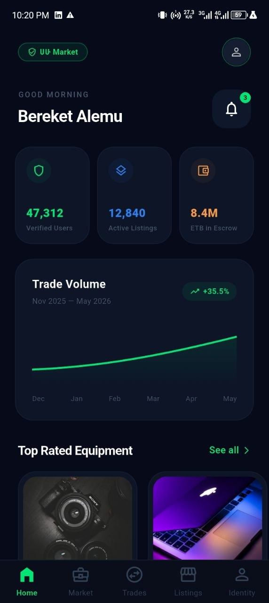
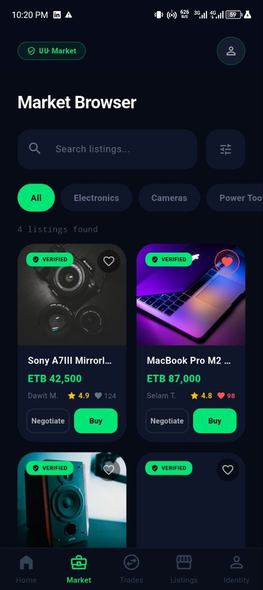
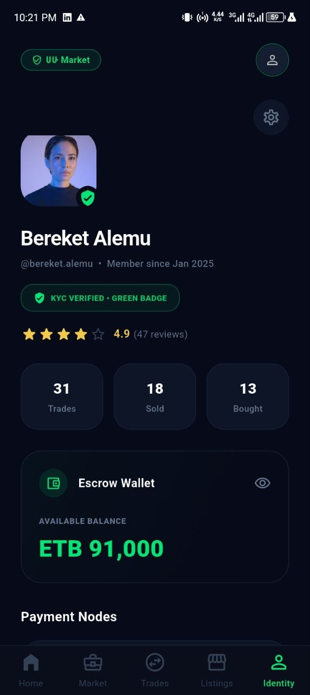
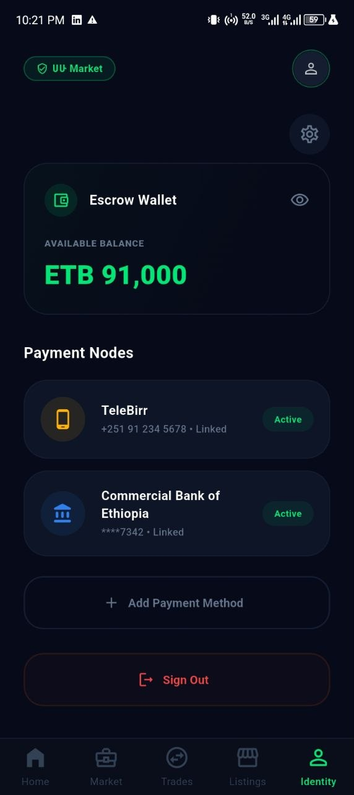
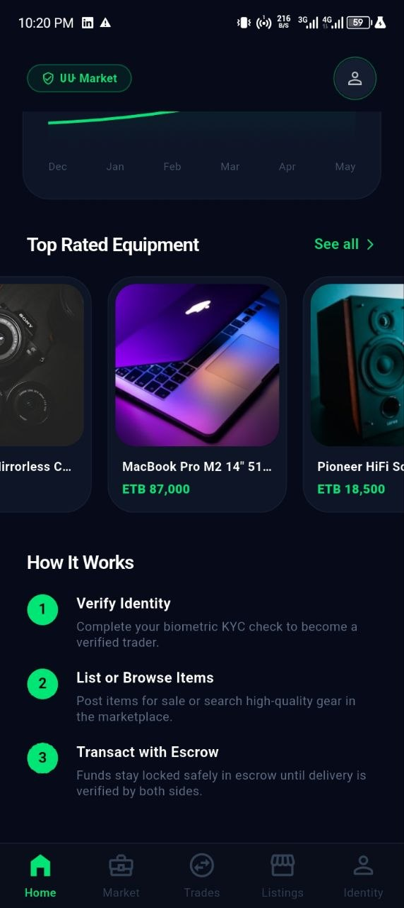
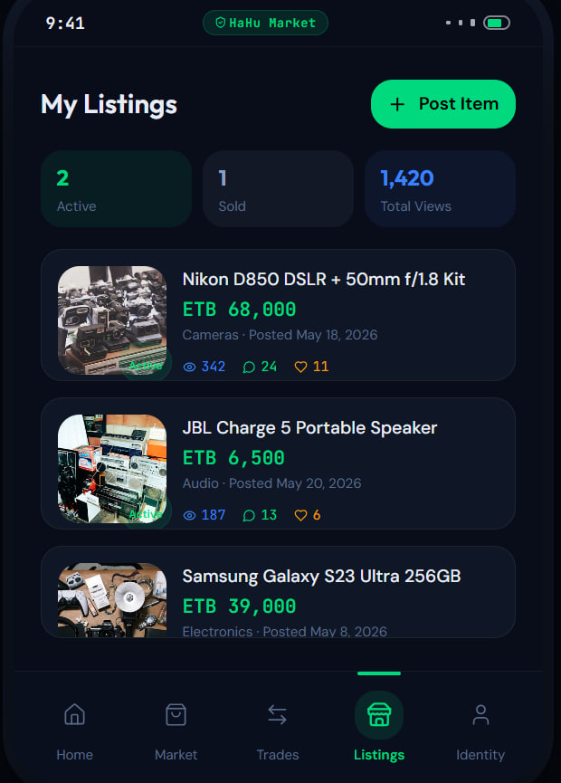
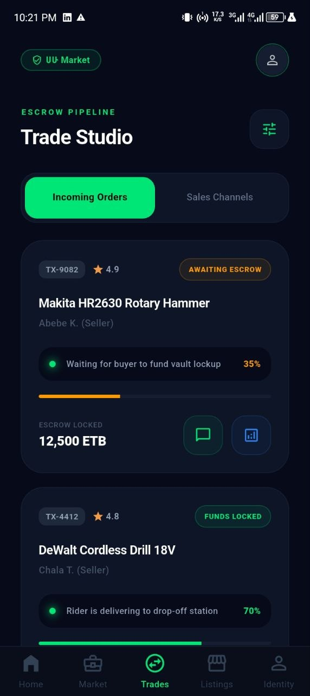

# 🛍️ Second-Hand Marketplace System

A modern and secure **second-hand marketplace mobile application** that enables users to buy and sell pre-owned products with confidence. The platform integrates **identity verification**, **secure wallet transactions**, **real-time messaging**, **GPS-based delivery tracking**, and **AI-powered scam detection** to create a trusted, intelligent, and secure digital marketplace.

---


## 📱 App Preview

| 🏠 Home | 🏠 Home Feed | 🛍️ Marketplace |
|:-------:|:------------:|:------------------------:|
|  |  |  |

| ✅ Verification Status |  🪪 Identity Verification | 📋 Product Listings |
|:----------------------:|:---------------:|:-------------------:|
|  |  |  |

| 🤝 Trading |  |  |
|:----------:|:--:|:--:|
|  |  |  |
```

---

## ✨ Features

### 🔐 Identity Verification

* Register securely using a National ID.
* Verify user identities to increase trust.
* Prevent fake accounts and fraudulent activities.

### 🛒 Marketplace

* Buy and sell second-hand products.
* Create, edit, and manage product listings.
* Browse products by category.
* Search and filter listings.
* Contact sellers instantly.

**Categories include:**

* 📱 Electronics
* 🚗 Vehicles
* 🪑 Furniture
* 👕 Clothing
* 🛠️ Tools
* 📚 Books
* 📦 And many more.

### 💰 Secure Wallet

* Built-in digital wallet.
* Secure payments between buyers and sellers.
* Escrow-style payment protection.
* Automatic payment release after successful delivery.

### 💬 Real-Time Chat

* Instant messaging.
* Product negotiation.
* Delivery coordination.
* Fast and secure communication.

### 🤖 AI Scam Detection

The AI engine continuously analyzes conversations to detect:

* Scam attempts
* Fraudulent behavior
* Illegal trading
* Harmful or suspicious language

The system automatically:

* 🚫 Blocks suspicious messages
* ⚠️ Warns users
* 🔒 Restricts repeat offenders
* 🛡️ Helps maintain a safe marketplace

### 📍 GPS Delivery Tracking

* Live GPS location tracking
* Delivery progress updates
* Real-time courier location
* Improved delivery transparency

### 🛡️ Safety & Moderation

* Automated content moderation
* User reporting system
* Admin dashboard
* User suspension and banning tools

---

## 🚀 Technology Stack

### 📱 Mobile

* Flutter
* Dart

### ⚙️ Backend

* Node.js
* Express.js
* MongoDB
* Socket.IO
* JWT Authentication

### 🤖 AI Services

* Python
* FastAPI
* Machine Learning
* AI Content Moderation

### ☁️ Additional Technologies

* Cloud Storage
* Push Notifications
* GPS & Maps Integration
* Digital Wallet
* REST API

---

## 🎯 Project Goal

Our mission is to build a **trusted, intelligent, and secure second-hand marketplace** where users can confidently buy and sell pre-owned products.

By combining **identity verification**, **secure digital payments**, **AI-powered scam detection**, **real-time communication**, and **GPS delivery tracking**, the platform delivers a safe, transparent, and modern marketplace experience.

This project is being developed as an **advanced cross-platform mobile application** with a strong emphasis on **security**, **performance**, **scalability**, and **user experience**.

---

## 👨‍💻 Team Project

This application is being developed collaboratively as a software engineering project using modern development practices, version control, and agile teamwork.
